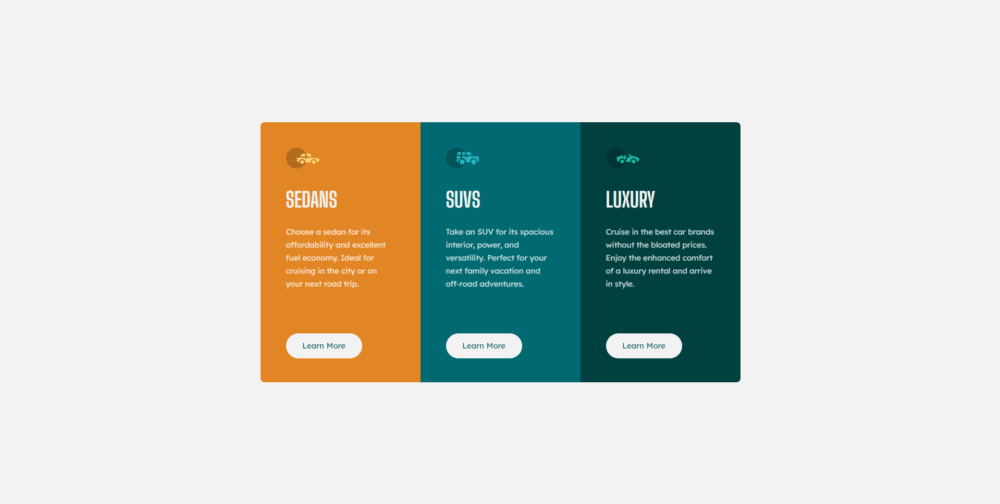

 

## The challenge

- Develop a page trying to make it as close as possible to the image made by the designer

## Links

- Solution URL: [Add solution URL here](https://your-solution-url.com)
- Live Site URL: [https://3-column-preview-card-component-main-topaz-two.vercel.app/](https://3-column-preview-card-component-main-topaz-two.vercel.app/)

## Built with

-  SASS
-  HTML

## What I learned

I found that you can leave animations in their final position using `animation-fill-mode: forwards;`

## **Resources**

-  [a great CSS animation library](https://animate.style/)

## **Author**

- Frontend Mentor - [@MarlonPassos-git](https://www.frontendmentor.io/profile/MarlonPassos-git)

